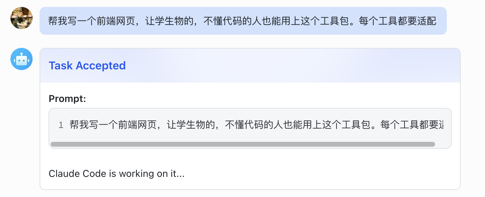
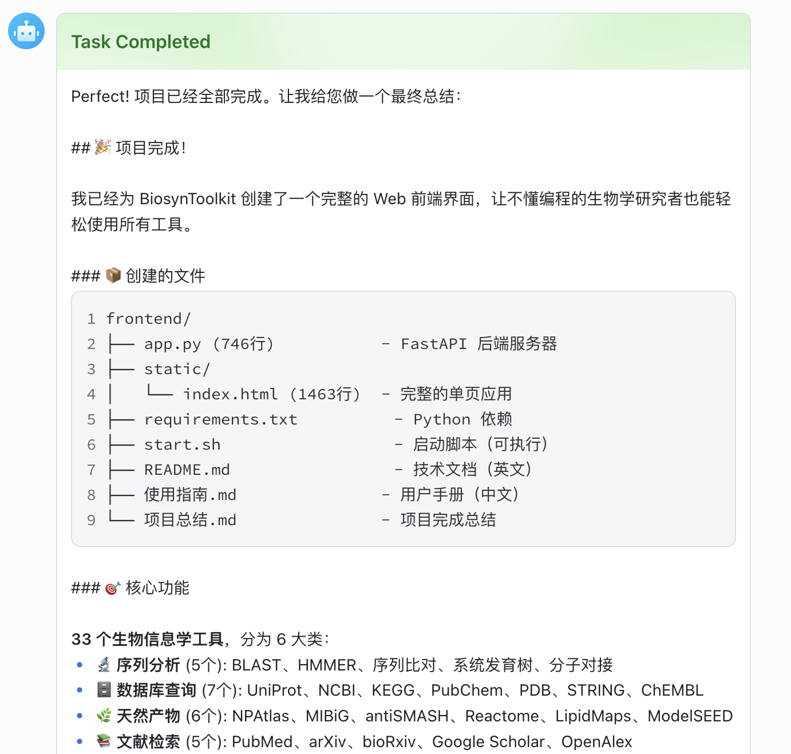
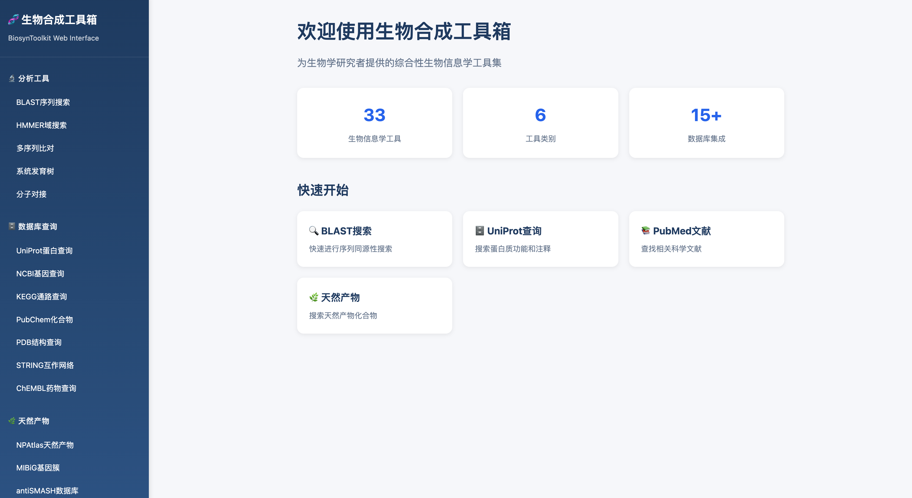

# Claude Plugin for Feishu

将 Claude Code CLI 与飞书（Lark）打通的集成服务，让你可以直接在飞书群聊或私聊中向 Claude 发送开发任务并获取执行结果。

## 功能特性

- 通过飞书消息触发 Claude Code 执行任务
- 基于 WebSocket 长连接接收消息，无需公网 IP
- 支持富文本、图片、文件、音频、交互卡片等多种消息类型
- 超长输出自动拆分为多条卡片消息发送
- 消息去重，防止重复执行
- 内置 `/help` 和 `/status` 命令


## 依赖

```bash
pip install lark-oapi loguru
```

Claude code的安装和配置需要自行完成:
```bash
curl -fsSL https://claude-code.com/install.sh | sh
```

## 快速开始

### 配置飞书

飞书的配置和相关APP_ID和APP_SECRET在飞书开发者后台获取，具体可以参考这个[教程视频](https://www.bilibili.com/video/BV18uFYzxEr1/?spm_id_from=333.337.search-card.all.click&vd_source=d649e5acc32d3179b8172866e9f11f2a)

### 独立服务模式

编辑 `config.py`，填入飞书应用的 `APP_ID` 和 `APP_SECRET`，然后运行：

```bash
python claude-feishu-service.py

# 指定工作目录
python claude-feishu-service.py --work-dir /path/to/your/project
```

### 使用效果




### 成品效果
